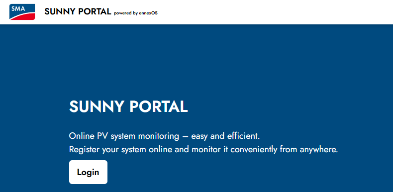

# MMM-SunnyPortalEnnexos

🌞 **MagicMirror Module for Ennexos SunnyPortal Solar Data**

Display real-time solar panel data from the new Ennexos SunnyPortal platform using cookie-based authentication.

| Status | Version | Date | Platform |
|:------- |:------- |:---- |:-------- |
| ✅ Working | 2.0.0 | 2025-07-25 | Ennexos SunnyPortal |

## 🚀 Features

- ✅ **Compatible with new Ennexos platform** (https://ennexos.sunnyportal.com)
- 🍪 **Cookie-based authentication** for reliable long-term access
- ⚡ **Real-time power generation** display
- 🔋 **Energy yield tracking** (daily, monthly, yearly, total)
- 📊 **System status monitoring**
- 🎨 **Customizable display options**
- 🔄 **Automatic data refresh**
- 🛡️ **Robust error handling** with retry logic

## 🆕 What's New in v2.0

This module has been completely rebuilt to work with the **new Ennexos SunnyPortal** platform:

- **Cookie-based authentication** replaces the old login system
- **Modern Angular SPA support** for the new Ennexos interface  
- **Enhanced data parsing** to extract solar metrics from HTML responses
- **Improved error handling** with graceful fallbacks
- **Long-term stability** (cookies last 365+ days)
- **Comprehensive documentation** and setup guides

## 📸 Screenshots

### Module Display


The module displays real-time solar data in a clean, organized format:
- ⚡ **Power Generation** - Current and peak power output
- 🔋 **Energy Production** - Daily, monthly, and total yields  
- 📊 **System Status** - Online status and efficiency metrics
- ⏰ **Last Update** - Timestamp of latest data refresh



Data is fetched from the **Ennexos SunnyPortal** at [ennexos.sunnyportal.com](https://ennexos.sunnyportal.com)

---

## 🛠️ Installation

### Prerequisites

- **MagicMirror²** installation
- **Node.js** and **npm**
- **Ennexos SunnyPortal account** with solar panel data

### Quick Installation

```bash
cd ~/MagicMirror/modules
git clone https://github.com/Warent2454/MMM-SunnyPortalEnnexos.git
cd MMM-SunnyPortalEnnexos
npm install
```

### Setup Process

1. **Install the module** (see above)
2. **Extract authentication cookies** (see [Cookie Setup](#cookie-setup))
3. **Configure the module** (see [Configuration](#configuration))
4. **Add to MagicMirror config** (see [MagicMirror Setup](#magicmirror-setup))

---

## 🔄 Updating the Module

### When the Git Repository is Updated

To update your MagicMirror module when new changes are available in the repository:

#### Method 1: Quick Update
```bash
cd ~/MagicMirror/modules/MMM-SunnyPortalEnnexos
git pull origin master
npm install
```

#### Method 2: Safe Update with Backup
```bash
cd ~/MagicMirror/modules/MMM-SunnyPortalEnnexos

# Backup your cookies file (important!)
cp cookies.txt cookies_backup.txt

# Pull latest changes
git pull origin master

# Install any new dependencies
npm install

# Restore your cookies if needed
cp cookies_backup.txt cookies.txt
```

#### Method 3: Complete Reinstall
If you encounter issues, perform a clean reinstall:

```bash
cd ~/MagicMirror/modules

# Backup your cookies file first!
cp MMM-SunnyPortalEnnexos/cookies.txt ~/cookies_backup.txt

# Remove old installation
rm -rf MMM-SunnyPortalEnnexos

# Fresh install
git clone https://github.com/Warent2454/MMM-SunnyPortalEnnexos.git
cd MMM-SunnyPortalEnnexos
npm install

# Restore your cookies
cp ~/cookies_backup.txt cookies.txt
```

### After Updating

1. **Restart MagicMirror** to apply changes:
   ```bash
   pm2 restart MagicMirror
   # OR if running manually:
   # Navigate to MagicMirror directory and run: npm start
   ```

2. **Check the logs** for any errors:
   ```bash
   pm2 logs MagicMirror
   # OR check the browser console if running in dev mode
   ```

3. **Verify functionality** by checking that solar data is displayed correctly

### Important Notes

- 🍪 **Always backup your `cookies.txt` file** before updating
- 🔄 **Check the [changelog](#version-history)** for breaking changes
- ⚠️ **Some updates may require cookie regeneration** if authentication changes
- 📝 **Review new configuration options** that might be available

### Troubleshooting Updates

If the module stops working after an update:

1. **Check your `cookies.txt` file** is still present and valid
2. **Regenerate cookies** from your browser if authentication fails
3. **Check for new required configuration** options in the documentation
4. **Review error logs** for specific issues:
   ```bash
   tail -f ~/.pm2/logs/MagicMirror-error.log
   ```

---

## 🍪 Cookie Setup

The module uses cookie-based authentication for reliable access to Ennexos data.

### Step 1: Login to Ennexos
1. Open your browser and go to [ennexos.sunnyportal.com](https://ennexos.sunnyportal.com)
2. Log in with your credentials
3. Wait for the dashboard to fully load

### Step 2: Extract Cookies

#### Method A: Browser Developer Tools
1. Press **F12** to open Developer Tools
2. Go to **Application** → **Cookies** → `https://ennexos.sunnyportal.com`
3. Copy all cookie values
4. Format as: `name1=value1; name2=value2; name3=value3`

#### Method B: Browser Extension
1. Install a "cookies.txt" browser extension
2. Export cookies for `ennexos.sunnyportal.com`
3. Save the exported content

### Step 3: Create Cookie File
Create a file called `cookies.txt` in the module directory:

```
__cmpcc=1; __cmpconsentx137893=YOUR_CONSENT_VALUE; _ga=YOUR_GA_VALUE; _ga_M03X504MKH=YOUR_ANALYTICS_VALUE
```

**🔒 Security Note:** Keep your `cookies.txt` file secure and never commit it to version control.

---

## ⚙️ Configuration

### Basic Configuration

Add this to your `config/config.js` file:

```javascript
{
    module: "MMM-SunnyPortalEnnexos",
    position: "top_right", // Choose your preferred position
    config: {
        // Required
        cookieFile: "cookies.txt",
        
        // Optional - Display settings
        updateInterval: 300000, // 5 minutes
        showTitle: true,
        showStatus: true,
        showPower: true,
        showEnergy: true,
        showDetails: true,
        
        // Optional - Formatting
        title: "Solar Portal",
        tableClass: "small", // small, medium, large
        decimalPlaces: 1
    }
}
```

### Advanced Configuration

```javascript
{
    module: "MMM-SunnyPortalEnnexos",
    position: "top_right",
    config: {
        // Authentication
        cookieFile: "cookies.txt",
        username: "your-email@example.com", // For reference only
        
        // Update intervals
        updateInterval: 300000,  // 5 minutes in milliseconds
        retryDelay: 30000,       // 30 seconds retry delay
        
        // Display options
        showTitle: true,
        showStatus: true,
        showPower: true,
        showEnergy: true,
        showDetails: true,
        
        // Formatting
        title: "🌞 Solar Portal",
        powerUnit: "W",
        energyUnit: "kWh", 
        decimalPlaces: 1,
        tableClass: "small",
        
        // API endpoints (advanced users)
        apiEndpoints: [
            "/dashboard/data",
            "/live/data",
            "/plants/data"
        ]
    }
}
```

---

## 🎛️ Configuration Options

| Option | Type | Default | Description |
|--------|------|---------|-------------|
| `cookieFile` | String | `"cookies.txt"` | **Required.** Path to cookie file |
| `updateInterval` | Number | `300000` | Update frequency in milliseconds |
| `retryDelay` | Number | `30000` | Delay before retrying failed requests |
| `showTitle` | Boolean | `true` | Show module title |
| `showStatus` | Boolean | `true` | Show connection status |
| `showPower` | Boolean | `true` | Show power generation data |
| `showEnergy` | Boolean | `true` | Show energy yield data |
| `showDetails` | Boolean | `true` | Show additional system details |
| `title` | String | `"Solar Portal"` | Custom module title |
| `tableClass` | String | `"small"` | Table size: small, medium, large |
| `decimalPlaces` | Number | `1` | Number of decimal places |
| `powerUnit` | String | `"W"` | Power unit for display |
| `energyUnit` | String | `"kWh"` | Energy unit for display |

---

## 🖥️ MagicMirror Setup

1. **Add the module** to your `config/config.js`
2. **Restart MagicMirror**
3. **Verify the display** shows solar data
4. **Check logs** for any authentication issues

### Example Full Config

```javascript
let config = {
    modules: [
        // ... other modules
        {
            module: "MMM-SunnyPortalEnnexos",
            position: "top_right",
            config: {
                cookieFile: "cookies.txt",
                updateInterval: 300000,
                title: "🌞 Solar Power",
                showPower: true,
                showEnergy: true,
                tableClass: "small"
            }
        }
    ]
};
```

---
```

Next install the dependencies: *request*, *flow* and *chartjs*, by running:

```bash
npm install request --save
npm install flow --save
npm install chart.js --save
npm install axios --save
npm install dotenv --save

```

Alternatively, on a *unix* based distribution, you can try to install all the above mentioned dependencies with the Bash script:

```bash
chmod 755 install_deps.sh
./install_deps.sh
```

## 🔧 Dependencies

This module uses modern dependencies for reliable operation:

```json
{
  "axios": "^1.7.7",
  "fs": "built-in",
  "path": "built-in"
}
```

- **[axios](https://github.com/axios/axios)** - Modern HTTP client for API requests
- **fs** - Built-in Node.js file system module
- **path** - Built-in Node.js path utilities

All dependencies are automatically installed via `npm install`.

---

## 🛠️ Troubleshooting

### Common Issues

#### ❌ "Authentication Failed" Error
**Cause:** Cookies have expired or are invalid
**Solution:** 
1. Re-extract cookies from your browser
2. Update the `cookies.txt` file
3. Restart MagicMirror

#### ❌ "No Data Available" Display
**Cause:** API endpoints not returning expected data
**Solution:**
1. Check MagicMirror logs for errors
2. Verify your Ennexos account has solar data
3. Test cookie validity manually

#### ❌ Module Not Loading
**Cause:** Configuration or installation issues
**Solution:**
1. Check `config.js` syntax
2. Verify module path is correct
3. Run `npm install` in module directory

### Cookie Maintenance

**Expected Cookie Lifespan:** 365+ days (very stable!)

Your cookies are primarily tracking cookies which last for months or years. However, if authentication fails:

1. **Re-extract cookies** from your browser
2. **Update cookies.txt** file  
3. **Restart MagicMirror**

### Debugging

Enable debugging by checking MagicMirror logs:

```bash
# View MagicMirror logs
tail -f ~/.pm2/logs/MagicMirror-out.log

# Or check module-specific logs
grep "MMM-SunnyPortalEnnexos" ~/.pm2/logs/MagicMirror-out.log
```

---

## 🤝 Contributing

Contributions are welcome! Please feel free to submit issues, feature requests, or pull requests.

### Development Setup

```bash
git clone https://github.com/Warent2454/MMM-SunnyPortalEnnexos.git
cd MMM-SunnyPortalEnnexos
npm install
```

### Project Structure

```
MMM-SunnyPortalEnnexos/
├── MMM-SunnyPortal.js          # Main module file
├── node_helper.js              # Backend data fetcher  
├── MMM-SunnyPortal.css        # Styling
├── package.json               # Dependencies
├── cookies.txt                # Your authentication cookies
├── translations/              # Language files
│   ├── en.json
│   ├── de.json
│   ├── fr.json
│   └── nl.json
└── images/                    # Screenshots
    ├── SunnyPortal1.png
    └── SunnyPortal2.png
```

---

## 📝 License

This project is licensed under the MIT License - see the [LICENSE](LICENSE) file for details.

---

## 🙏 Acknowledgments

- **Original MMM-SunnyPortal** by [linuxtuxie](https://github.com/linuxtuxie)
- **MagicMirror²** framework by [MichMich](https://github.com/MichMich/MagicMirror)
- **SMA/Ennexos** for providing the solar portal platform

---

## 📧 Support

For issues, questions, or support:

1. **Check the [Troubleshooting](#troubleshooting) section**
2. **Search existing [GitHub Issues](https://github.com/Warent2454/MMM-SunnyPortalEnnexos/issues)**
3. **Create a new issue** with detailed information
4. **Include logs and configuration** for faster resolution

---

## 🔄 Version History

| Version | Date | Changes |
|---------|------|---------|
| 2.0.0 | 2025-07-25 | Complete rebuild for Ennexos platform |
| 1.5.0 | 2025-07-24 | Updated for new SunnyPortal |
| 1.x.x | Earlier | Original SunnyPortal versions |

---

## ⚡ Quick Reference

### 🔄 Update Commands
```bash
# Quick update
cd ~/MagicMirror/modules/MMM-SunnyPortalEnnexos && git pull && npm install

# Restart MagicMirror
pm2 restart MagicMirror

# Check logs
pm2 logs MagicMirror
```

### 🍪 Cookie File Location
```bash
~/MagicMirror/modules/MMM-SunnyPortalEnnexos/cookies.txt
```

### 🛠️ Common Troubleshooting
```bash
# Backup cookies before any changes
cp cookies.txt cookies_backup.txt

# View real-time logs
tail -f ~/.pm2/logs/MagicMirror-error.log

# Full restart
pm2 stop MagicMirror && pm2 start MagicMirror
```

---

**🌞 Happy Solar Monitoring! ⚡** 

